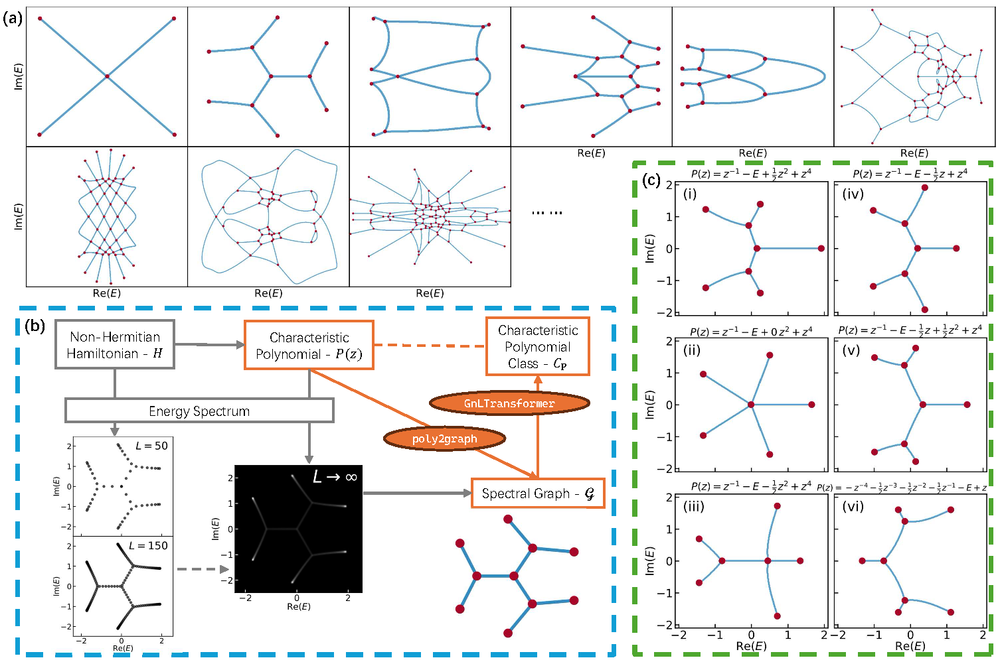
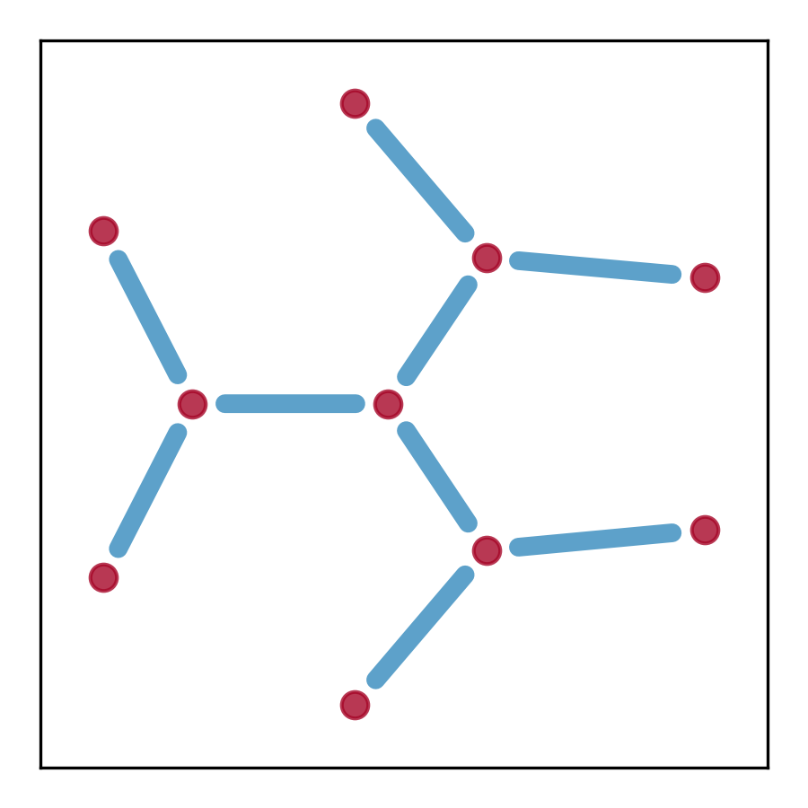

# Poly2Graph & GnLTransformer 
<!-- [📄 *arXiv*](https://arxiv.org/) -->

`Poly2Graph` is a Python package for automatic non-Hermitian spectral graph construction. It takes in the characteristic polynomial and returns the spectral graph.

> Topological physics is one of the most dynamic and rapidly advancing fields in modern physics. Conventionally, topological classification focuses on eigenstate windings, a concept central to Hermitian topological lattices (e.g., topological insulators). Beyond such notion of topology, we unravel a distinct and diverse graph topology emerging in non-Hermitian systems' energy spectra, featuring a kaleidoscope of exotic shapes like stars, kites, insects, and braids. The spectral graph solely depends on the algebraic form of characteristic polynomial.

<p align="center">
    
</p>

`GnLTransformer` is an explainable graph neural network that integrates multi-head attention mechanism and leverages line graphs as dual channels to explicitly capture higher-order relationships beyond node-node interactions.

<p align="center">
    
</p>

## Features
- **Poly2Graph**
  1. Fast construction of spectral graph from characteristic polynomial
  2. Support for one-band and multi-band systems
  3. Adaptive resolution for spectral potential calculation
  4. Automatic Spectral Boundary Determination
  5. Convert skeletonized image to its graph representation
  6. Dataset generation (one-band only)
  7. Visualization of spectral potential, density of states, and spectral graph

- **GnLTransformer**
  1. Line graph as dual channels. Extensible to capture any higher-order relationships.
  2. Explainability: Multi-head attention
  3. Visualization of node & edge attention weights and embedding similarity matrices

## Installation

First make sure you have installed [`tensorflow`](https://www.tensorflow.org/) [`pytorch`](https://pytorch.org/), and [`torch_geometric`]( https://pytorch-geometric.readthedocs.io/en/latest/) according to your machine specifics. This module is tested on `Python 3.11.9`, `tensorflow 2.17.0`, `torch 2.4.1+cu121`, and `torch_geometric 2.6.1`.

`tensorflow` (CPU version is enough) is required for the optimization of `poly2graph`. `GnLTransformer` is written in `pytorch` and `torch_geometric`.

You can install the package via pip:

```bash
$ pip install poly2graph
```

or clone the repository and install it manually:

```bash
$ git clone https://github.com/sarinstein-yan/poly2graph.git
$ cd poly2graph
$ pip install -e . # or turn off the editable mode running `pip install .`
```

Check the installation:

```python
import poly2graph as p2g
print(p2g.__version__)
```

## Usage

See the [Poly2Graph Tutorial JupyterNotebook](https://github.com/sarinstein-yan/poly2graph/blob/main/poly2graph_demo.ipynb).

Here we only list the core few functionalities.

### One-band Spectral Graph

Take a one-band characteristic polynomial as an example:
$$P(E,z) = -z^{-2} - E - z + z^4$$
its coefficient list is `c = [0, 0, -1, 0, 0, -1, 0, 0, 1]`. `poly2graph` only takes in **symmetric** coefficient list where the middle element is the constant term (i.e. the coefficient of $z^0$). This is how `poly2graph` identifies the degree range.

```python
### coefficient list (symmetrically formatted)
c = np.array([0, 0, -1, 0, 0, -1, 0, 0, 1])
```

Call `spectral_graph` with the coefficient list `c` and the energy range `E_max`, it will return the spectral graph as a networkx multigraph object.

The complex energy domain should be square grid that contains the spectral graph. The parameter `E_max` could be a list of 4 real numbers that specifies 
$$[\text{Re}(E)_\text{min}, \text{Re}(E)_\text{max}, \text{Im}(E)_\text{min}, \text{Im}(E)_\text{max}]$$
or a single real number which will be interpreted as
$$E_\text{max}=\text{Re}(E)_\text{max}=\text{Re}(E)_\text{min}=\text{Im}(E)_\text{max}=\text{Im}(E)_\text{min}$$

> [!TIP]
> The recommended way is to call `auto_Emaxes` to automatically determine the energy range (but so far it only supports one-band polynomial). Pass `c` as a `numpy.array`; otherwise, numba will raise an error.

```python
### automatic boundaries of the energy grid
# `c` should be numpy array if `auto_Emaxes` is called
# otherwise numba will raise an error
E_maxes = p2g.auto_Emaxes(c)
print('Re(E) (min):', E_maxes[0], '  Re(E) (max):', E_maxes[1])
print('Im(E) (min):', E_maxes[2], '  Im(E) (max):', E_maxes[3])

### spectral graph
sg = p2g.spectral_graph(c, E_max=E_maxes)
print('\nObject type:', type(sg))

### plot spectral graph
fig, ax = plt.subplots(figsize=(3, 3))
pos_dict = {i[0]: (i[1][1], i[1][0]) for i in sg.nodes(data='o')}
nx.draw_networkx(sg, pos=pos_dict, ax=ax,
                 node_size=50, node_color='#A60628', with_labels=False, 
                 width=5, edge_color='#348ABD')
plt.show()
```
```text
Re(E) (min): -2.4020020322545883   Re(E) (max): 2.5671486238803536
Im(E) (min): -2.4845753280674696   Im(E) (max): 2.4845753280674723

Object type: <class 'networkx.classes.multigraph.MultiGraph'>
```
<p align="center">
    
</p>

Let us diagonalize a real-space Hamiltonian to verify the spectral graph overlaps with the energy spectrum in thermodynamic limit ($L\to\infty$), and visualize the density of states (DOS) in TDL (see the companion paper for details).

The DOS, $\rho(E)$, is proportional to the lapaclacian of the spectral potential, $\Phi(E)$:
$$\rho(E) = -\frac{1}{2\pi} \Delta \Phi(E)$$
$\Delta = \partial_{\text{Re} E}^2 + \partial_{\text{Im} E}^2$ is the Laplacian operator on the complex energy plane. Laplacian operator extracts curvature; thus, geometrically speaking, the loci of spectral graph $\mathcal{G}$ resides on the *ridges* of the Coulomb potential landscape.

```python
fig, ax = plt.subplots(1,3, figsize=(8,3), sharex=True, sharey=True,
                       gridspec_kw={'hspace':.0, 'wspace':.0})

num_sites = [50, 150]
for i, num_site in enumerate(num_sites):
    ### the spectrum of a finite real-space Hamiltonian
    energies = p2g.real_space_spectra_1band(c, num_site)
    ax[i].scatter(*energies, s=8, c='k', alpha=.6)
    ax[i].set(aspect='equal', xlim=E_maxes[:2], ylim=E_maxes[2:])
    ax[i].text(.95, .95, f'({chr(97+i)}) $L = {num_site}$',
                ha='right', va='top', transform=ax[i].transAxes)
    ax[i].tick_params(axis='both', which='both', pad=2, direction='in')
    ax[i].set_xlabel('Re($E$)', labelpad=.1)
    if i == 0: ax[i].set_ylabel('Im($E$)', labelpad=.0)

### the spectral potential
# the `E_len` parameter is the number of points per energy axis
phi = p2g.spectral_potential(c, E_max=E_maxes, E_len=200)
### the density of states (i.e. the laplacian of the spectral potential)
dos = p2g.PosGoL(phi) # `PosGoL` is our custom laplacian operator
ax[-1].imshow(dos, cmap='gray', origin='lower', extent=E_maxes, aspect='equal')
ax[-1].set_xlabel('Re($E$)', labelpad=.1)
ax[-1].text(.97, .97, '(c) DOS in TDL\n( $L\\to \infty$ )', color='w',
                ha='right', va='top', transform=ax[-1].transAxes)
ax[-1].tick_params(axis='both', which='both', pad=2, direction='in', color='w')
plt.show()
```
<p align="center">
    
</p>

### Node, Edge, and Graph-level Attributes

- Node
  1. `o`: the position of the node $(\text{Re}(E), \text{Im}(E))$
  2. `dos`: the density of states at the node
  3. `potential`: the spectral potential at the node
- Edge
  1. `weight`: the length of the edge
  2. `pts`: the positions of the points constituting the edge
  3. `avg_dos`: the average density of states along the edge
  4. `avg_potential`: the average spectral potential along the edge
- Graph
  1. `E_max`: the energy range (as a list of 4 real numbers)
  2. `E_len`: the grid resolution (i.e. the number of nodes along the real / imaginary axes)
  3. `polynomial_coeff`: the coefficient list of the characteristic polynomial (symmetrically formatted, as a numpy array)

### Multi-band Spectral Graph

Take a multi-band characteristic polynomial as an example:
$$P(E,z) = z^{-1} + 1/2 E z - E^{2} + z^2$$
whose minimal Hamiltonian is
$$
h(z) = \begin{pmatrix}
1/2 z & z^2+z^{-1} \\
1 & 0
\end{pmatrix}
$$
where the phase factor is defined as $z:=e^{ik}$.

`poly2graph` only takes in **symmetric** (rectangular) coefficient *matrix* where the middle element is the constant term (i.e. the coefficient of $z^0 E^0$):
$$\mathbf{c} = \begin{pmatrix}
\ddots & \vdots & \vdots & \vdots & \vdots & \vdots & \cdots \\
\cdots & c(z^{-2}E^{-2}) & c(z^{-1}E^{-2}) & c(z^0E^{-2}) & c(z^1E^{-2}) & c(z^2E^{-2}) & \cdots \\
\cdots & c(z^{-2}E^{-1}) & c(z^{-1}E^{-1}) & c(z^0E^{-1}) & c(z^1E^{-1}) & c(z^2E^{-1}) & \cdots \\
\cdots & c(z^{-2}E^0) & c(z^{-1}E^0) & {\color{orange} c(z^0E^0)} & c(z^1E^0) & c(z^2E^0) & \cdots \\
\cdots & c(z^{-2}E^1) & c(z^{-1}E^1) & c(z^0E^1) & c(z^1E^1) & c(z^2E^1) & \cdots \\
\cdots & c(z^{-2}E^2) & c(z^{-1}E^2) & c(z^0E^2) & c(z^1E^2) & c(z^2E^2) & \cdots \\
\cdots & \vdots & \vdots & \vdots & \vdots & \vdots & \ddots
\end{pmatrix}$$

Thus for this particular example, its coefficient matrix is:
$$c=\begin{pmatrix}
0 & 0 & 0 & 0 & 0 \\
0 & 0 & 0 & 0 & 0 \\
0 & 1 & 0 & 0 & 1 \\
0 & 0 & 0 & 1/2 & 0 \\
0 & 0 & -1 & 0 & 0
\end{pmatrix}$$

> [!NOTE] 
> Note that `auto_Emaxes` and `E_splits>1` are not yet supported for multi-band polynomials.

## TODO
- [ ] Automatic energy grid boundary determination for multi-band systems
- [ ] Adaptive resolution for multi-band systems
- [ ] Tutorials for dataset generation and `GnLTransformer`

<!-- ## Citation
If you find this work useful, please cite our paper:

```bibtex
@article{}
``` -->